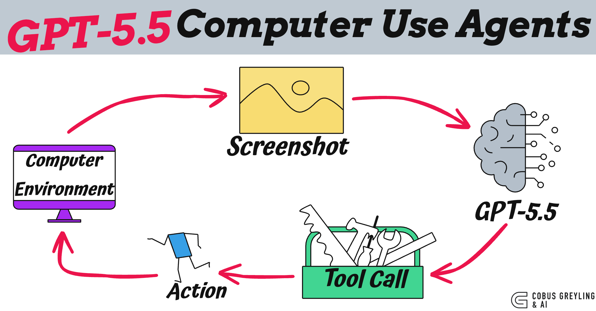
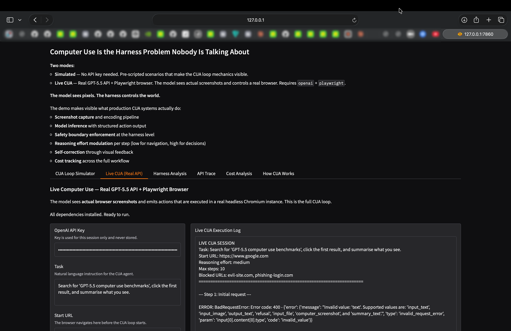
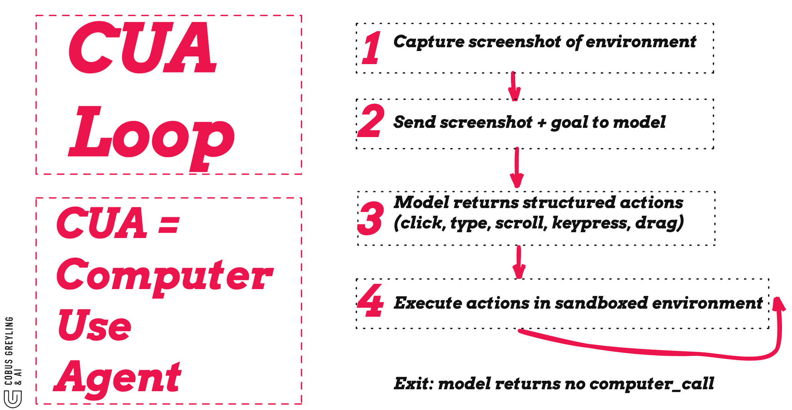

# GPT-5.5 Computer Use Agents



OpenAI released GPT-5.5 on 23 April 2026. Among its headline capabilities is native computer use — the model can see your screen, click buttons, type text, and navigate software.

Before physical or embodied autonomy is achieved, digital autonomy must first be achieved.

**The model gives you vision. The harness gives you agency.**

## Blog

Read the full analysis: **[blog.md](blog.md)**

Covers the CUA loop architecture, what changed from GPT-5.4, why computer use is a harness problem, and the message to builders.

## Demo

The included demo app demonstrates the CUA loop in two modes:

- **Simulated** — No API key needed. Pre-scripted scenarios that make the CUA loop mechanics visible.
- **Live CUA** — Real GPT-5.5 API + Playwright browser. The model sees actual screenshots and controls a real browser.



### Run

```bash
pip install gradio pillow matplotlib

python gpt55_computer_use_demo.py
```

For live mode (optional):

```bash
pip install openai playwright
playwright install chromium
export OPENAI_API_KEY=sk-...
```

## Key Insight

The CUA (Computer Using Agent) architecture is a loop: capture screenshot, send to model, receive structured actions (`click`, `type`, `scroll`, `keypress`, `drag`), execute in a sandboxed environment, repeat.

The model never touches the environment directly. It sees pixels. It emits structured instructions. Everything between — the browser, the VM, the screenshot pipeline, the action execution, the sandbox boundaries — is harness.



## References

- [Introducing GPT-5.5 | OpenAI](https://openai.com/index/introducing-gpt-5-5/)
- [Computer use | OpenAI API](https://developers.openai.com/api/docs/guides/tools-computer-use)
- [OpenAI CUA Sample App](https://github.com/openai/openai-cua-sample-app)

---

*Chief AI Evangelist @ Kore.ai | I'm passionate about exploring the intersection of AI and language. From Language Models, AI Agents to Agentic Applications, Development Frameworks & Data-Centric Productivity Tools, I share insights and ideas on how these technologies are shaping the future.*
